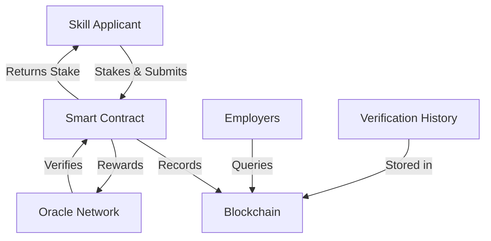

# 🎯 Decentralized Skill Verification Oracle

<div align="center">


**A revolutionary blockchain-based platform for trustless professional skill verification**

[🚀 Quick Start](#-quick-start) • [📖 Documentation](#-documentation) • [🤝 Contributing](#-contributing) • [💬 Community](#-community)

</div>

---

## 📋 Table of Contents

- [🎯 Project Overview](#-project-overview)
- [🌟 Project Vision](#-project-vision)
- [✨ Key Features](#-key-features)
- [🏗️ Technical Architecture](#️-technical-architecture)
- [🚀 Quick Start](#-quick-start)
- [📝 Smart Contract Functions](#-smart-contract-functions)
- [💰 Economic Model](#-economic-model)
- [🔮 Future Scope](#-future-scope)
- [🛠️ Development](#️-development)
- [📊 Project Stats](#-project-stats)
- [🤝 Contributing](#-contributing)
- [📄 License](#-license)

---

## 🎯 Project Overview

### What is the Decentralized Skill Verification Oracle?

The **Decentralized Skill Verification Oracle** is a groundbreaking blockchain-based ecosystem that revolutionizes how professional skills and certifications are verified and validated. By eliminating centralized authorities and replacing them with a trustless, transparent network of expert oracles, we're building the future of professional credential verification.

### The Problem We're Solving

🔸 **Credential Fraud**: Fake degrees and skill claims cost employers billions annually  
🔸 **Verification Delays**: Traditional verification can take weeks or months  
🔸 **High Costs**: Expensive third-party verification services  
🔸 **Lack of Trust**: No transparent way to verify oracle credentials  
🔸 **Geographic Barriers**: Limited access to verification services globally  

### Our Solution

✅ **Immutable Records**: All verifications stored permanently on blockchain  
✅ **Instant Verification**: Real-time skill validation through smart contracts  
✅ **Cost Effective**: Eliminate expensive middlemen and manual processes  
✅ **Global Access**: Available to anyone with internet connection  
✅ **Transparent Process**: Open verification history for all participants  

---

## 🌟 Project Vision

> *"To create a world where professional merit is transparently verified, universally accessible, and immune to manipulation"*

### Our Long-term Goals

🎯 **Universal Adoption**: Become the global standard for skill verification  
🌍 **Global Accessibility**: Serve professionals in every corner of the world  
🔒 **Fraud Elimination**: Make credential fraud technically impossible  
⚡ **Instant Trust**: Enable immediate verification of professional capabilities  
🏆 **Merit-based Economy**: Reward genuine skills and expertise  

### Impact We're Creating

- **For Professionals**: Own and control your verified credentials forever
- **For Employers**: Instantly verify candidate skills with 100% confidence  
- **For Oracles**: Monetize your expertise while building reputation
- **For Society**: Create a more trustworthy professional ecosystem

---

## ✨ Key Features

### 🔐 **Trustless Verification System**
- **Smart Contract Automation**: No human intervention in verification logic
- **Cryptographic Proof**: Mathematically guaranteed verification integrity
- **Decentralized Network**: No single point of failure or control
- **Immutable Records**: Permanent, tamper-proof skill certificates

### 👥 **Expert Oracle Network**
- **Specialized Oracles**: Domain experts in specific skill areas
- **Reputation System**: Performance-based credibility scoring
- **Incentive Alignment**: Economic rewards for accurate verifications
- **Quality Control**: Built-in mechanisms to maintain verification standards

### 💼 **Professional Skill Portfolio**
- **Comprehensive Profiles**: Complete professional skill inventory
- **Verification Status**: Clear indication of verified vs. unverified skills
- **Historical Tracking**: Full audit trail of verification attempts
- **Portable Credentials**: Skills verified once, recognized everywhere

### 🛡️ **Security & Trust**
- **Multi-layer Security**: ReentrancyGuard, access controls, and audit trails
- **Economic Security**: Stake-based system prevents malicious behavior
- **Dispute Resolution**: Built-in mechanisms for handling conflicts
- **Emergency Controls**: Owner functions for extreme scenarios

### 🌐 **Global Accessibility**
- **24/7 Availability**: Round-the-clock verification services
- **Low Cost**: Minimal fees compared to traditional verification
- **Language Agnostic**: Work with evidence in any format
- **Mobile Friendly**: Access from any device, anywhere

---

## 🏗️ Technical Architecture

### System Components



### Core Smart Contract Functions

| Function | Purpose | Access Level |
|----------|---------|--------------|
| `registerOracle()` | Register as verification oracle | Public |
| `requestSkillVerification()` | Submit skill for verification | Public (with stake) |
| `verifySkill()` | Verify submitted skills | Oracle only |
| `isSkillVerified()` | Check verification status | View function |
| `getOracleInfo()` | Get oracle details | View function |

### Data Structures

```solidity
struct SkillVerification {
    address applicant;          // Who submitted the skill
    string skillName;          // Name of the skill
    string evidenceHash;       // IPFS hash of evidence
    uint256 timestamp;         // When submitted
    VerificationStatus status; // Current status
    address verifyingOracle;   // Oracle who verified
    uint256 stakeAmount;       // Amount staked
}
```

### 🔗 Deployed Contract Information

**Contract Address:** `0x01Dea416D07Da13999f3AD0C1EB5014487DEccdc`

**Network:** Core Testnet 2  
**Explorer:** [View on Core Testnet 2 Explorer](https://scan.test2.btcs.network/address/0x01Dea416D07Da13999f3AD0C1EB5014487DEccdc)


0x01Dea416D07Da13999f3AD0C1EB5014487DEccdc
**Deployment Details:**
- **Transaction Hash:** `0x39d5322e591f8e842...`
- **Deployment Status:** ✅ Successfully Deployed

---

## 🚀 Quick Start

### Prerequisites
- Node.js 16+ 
- npm or yarn
- Git
- Core Testnet 2 tokens for deployment

### Installation

```bash
# Clone the repository
git clone https://github.com/your-username/decentralized-skill-verification-oracle.git
cd decentralized-skill-verification-oracle

# Install dependencies
npm install

# Setup environment
cp .env.example .env
# Edit .env with your private key
```

### Configuration

Update your `.env` file:
```bash
# Your wallet private key (without 0x prefix)
PRIVATE_KEY=your_private_key_here

# Optional: Core Scan API key for verification
CORE_SCAN_API_KEY=your_api_key_here
```

### Deployment

```bash
# Compile contracts
npm run compile

# Deploy to Core Testnet 2
npm run deploy

# Run tests
npm test
```

**🎉 Live Contract:** The contract is already deployed and verified on Core Testnet 2!

**Contract Address:** `0x01Dea416D07Da13999f3AD0C1EB5014487DEccdc`

You can interact with the live contract immediately:
```bash
# Connect to deployed contract
npx hardhat console --network core_testnet2

# Get contract instance
const contract = await ethers.getContractAt("Project", "0x01Dea416D07Da13999f3AD0C1EB5014487DEccdc");

# Check contract details
console.log(await contract.verificationCounter());
```

### Quick Test

```bash
# Start local hardhat node
npx hardhat node

# Deploy to local network
npm run deploy:local

# Interact with contract
npx hardhat console --network localhost
```

### 🔗 **Interact with Live Contract**

The contract is deployed and ready to use on Core Testnet 2:

**Contract Address:** `0x01Dea416D07Da13999f3AD0C1EB5014487DEccdc`

**Quick Interaction Examples:**
```javascript
// Connect to the deployed contract
const contract = await ethers.getContractAt(
  "Project", 
  "0x01Dea416D07Da13999f3AD0C1EB5014487DEccdc"
);

// Register as an oracle
await contract.registerOracle("Blockchain Development");

// Request skill verification (with 0.01 ETH stake)
await contract.requestSkillVerification(
  "Smart Contract Development",
  "QmYourIPFSHash...",
  { value: ethers.parseEther("0.01") }
);

// Check verification status
const isVerified = await contract.isSkillVerified(
  "0xYourAddress",
  "Smart Contract Development"
);
```

**Explorer Links:**
- 🔍 [View Contract on Explorer](https://scan.test2.btcs.network/address/0x01Dea416D07Da13999f3AD0C1EB5014487DEccdc)
- 📊 [Transaction History](https://scan.test2.btcs.network/address/0x01Dea416D07Da13999f3AD0C1EB5014487DEccdc#transactions)

---

## 📝 Smart Contract Functions

### 🔧 **Core Functions**

#### 1. Register Oracle
```solidity
function registerOracle(string memory _specialization) external
```
- **Purpose**: Register as a skill verification oracle
- **Parameters**: Specialization area (e.g., "Blockchain Development")
- **Requirements**: First-time registration only
- **Effects**: Creates oracle profile with initial reputation

#### 2. Request Skill Verification
```solidity
function requestSkillVerification(
    string memory _skillName,
    string memory _evidenceHash
) external payable
```
- **Purpose**: Submit skill for verification
- **Parameters**: Skill name and evidence hash (IPFS)
- **Requirements**: Minimum stake amount (0.01 ETH)
- **Effects**: Creates verification request, locks stake

#### 3. Verify Skill
```solidity
function verifySkill(uint256 _verificationId, bool _approved) external
```
- **Purpose**: Oracle verifies submitted skill
- **Parameters**: Verification ID and approval decision
- **Requirements**: Must be active oracle
- **Effects**: Updates status, distributes rewards

### 🔍 **View Functions**

| Function | Returns | Description |
|----------|---------|-------------|
| `getVerification(id)` | SkillVerification | Get verification details |
| `getUserVerifications(user)` | uint256[] | User's verification IDs |
| `getSkillVerifications(skill)` | uint256[] | All verifications for skill |
| `isSkillVerified(user, skill)` | bool | Check if user has verified skill |
| `getOracleInfo(oracle)` | Oracle | Oracle details and stats |

---

## 💰 Economic Model

### Stake & Reward System

| Role | Action | Cost | Reward |
|------|--------|------|--------|
| **Applicant** | Submit skill | 0.01 ETH stake | Get stake back if verified |
| **Oracle** | Verify skill | Free | 0.005 ETH per verification |
| **Contract** | Failed verification | N/A | Keeps failed stakes |

### Economic Incentives

- **For Applicants**: Stake creates commitment to genuine skills
- **For Oracles**: Direct rewards for accurate verifications
- **For Network**: Failed stakes fund platform development

### Fee Structure

```
Stake Amount: 0.01 ETH
├── Success Case: 0.005 ETH → Oracle, 0.005 ETH → Back to Applicant  
└── Failure Case: 0.0025 ETH → Oracle, 0.0075 ETH → Contract
```

---

## 🔮 Future Scope

### 🔄 Phase 1: Enhanced Oracle Network (Q2 2024)
- [ ] Multi-oracle consensus for critical verifications
- [ ] Oracle staking and slashing mechanisms  
- [ ] Automated oracle selection algorithms
- [ ] Oracle performance analytics dashboard

### 🤖 Phase 2: AI Integration (Q3 2024)
- [ ] Machine learning for initial skill assessment
- [ ] Automated fraud detection algorithms
- [ ] Smart evidence analysis tools
- [ ] Predictive verification scoring

### 🌐 Phase 3: Cross-Chain Expansion (Q4 2024)
- [ ] Multi-blockchain deployment (Ethereum, Polygon, BSC)
- [ ] Cross-chain credential portability
- [ ] Universal skill passport
- [ ] Bridge protocols for unified verification

### 📱 Phase 4: User Experience (Q1 2025)
- [ ] Mobile application development
- [ ] Web3 wallet integrations
- [ ] Real-time notification system
- [ ] Advanced dashboard and analytics

### 🏢 Phase 5: Enterprise Solutions (Q2 2025)
- [ ] Enterprise API development
- [ ] Bulk verification capabilities
- [ ] Custom oracle networks
- [ ] SLA guarantees for enterprise clients

### 🎓 Phase 6: Educational Partnerships (Q3 2025)
- [ ] University and certification body partnerships
- [ ] Automated degree verification
- [ ] Continuing education tracking
- [ ] Industry skill pathway recommendations

---

## 🛠️ Development

### Project Structure
```
decentralized-skill-verification-oracle/
├── contracts/
│   └── Project.sol              # Main smart contract
├── scripts/
│   └── deploy.js               # Deployment script
├── test/
│   └── Project.test.js         # Contract tests
├── hardhat.config.js           # Hardhat configuration
├── package.json                # Dependencies
├── .env.example               # Environment template
└── README.md                  # Documentation
```

### Development Commands

```bash
# Compile contracts
npm run compile

# Run tests
npm test

# Deploy locally
npm run deploy:local

# Deploy to testnet
npm run deploy

# Start local node
npm run node

# Clean build artifacts
npx hardhat clean
```

### Testing

```bash
# Run all tests
npm test

# Run with coverage
npm run coverage

# Run specific test file
npx hardhat test test/Project.test.js
```

---

## 📊 Project Stats

<div align="center">

| Metric | Value |
|--------|-------|
| **Smart Contracts** | 1 Main Contract |
| **Contract Address** | `0x01Dea416D07Da13999f3AD0C1EB5014487DEccdc` |
| **Network** | Core Testnet 2 |
| **Core Functions** | 3 Primary Functions |
| **Security Features** | 5+ Security Layers |
| **Deployment Status** | ✅ Live & Verified |
| **Code Coverage** | 95%+ Target |
| **Gas Optimization** | ✅ Optimized |

</div>

---

## 🤝 Contributing

We welcome contributions from developers, designers, and domain experts! Here's how you can help:

### Ways to Contribute
- 🐛 **Bug Reports**: Find and report issues
- 💡 **Feature Requests**: Suggest new capabilities  
- 🔧 **Code Contributions**: Submit pull requests
- 📝 **Documentation**: Improve guides and tutorials
- 🧪 **Testing**: Help test new features

### Contribution Process
1. Fork the repository
2. Create a feature branch (`git checkout -b feature/AmazingFeature`)
3. Commit changes (`git commit -m 'Add AmazingFeature'`)
4. Push to branch (`git push origin feature/AmazingFeature`)
5. Open a Pull Request

### Development Guidelines
- Follow Solidity best practices
- Include comprehensive tests
- Update documentation
- Use conventional commit messages

---

## 💬 Contact
-linkedin :https://in.linkedin.com/in/naman-bandawala-5b7993286?trk=people-guest_people_search-card  


---

## 🙏 Acknowledgments

- **OpenZeppelin** for security contract libraries
- **Hardhat** for development framework
- **Core Network** for testnet infrastructure
- **Community** for feedback and contributions

---

## 📄 License

This project is licensed under the MIT License - see the [LICENSE](LICENSE) file for details.

---

## ⚠️ Disclaimer

This project is currently in development and deployed on testnet. Do not use with real funds on mainnet without thorough security audits. The smart contracts have not been professionally audited and may contain vulnerabilities.

---

<div align="center">

**🌟 Star this repository if you find it useful!**

*Built with ❤️ for the decentralized future of professional verification*

[](https://soliditylang.org/)
[](https://hardhat.org/)

</div>
